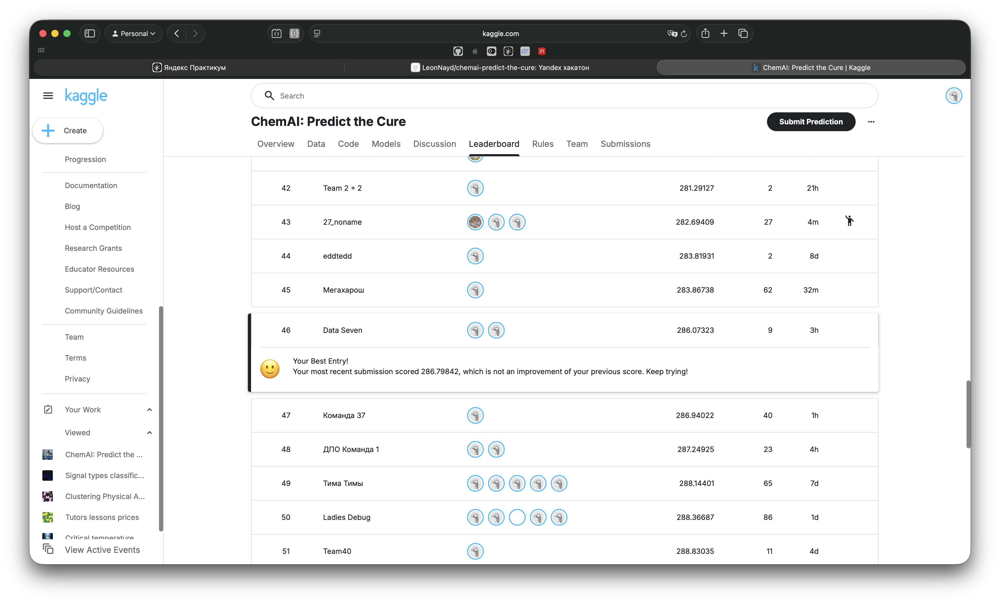

# ChemAI Predict the Cure

Решение соревнования по предсказанию биологических показателей химических соединений:
**IC50** (подавление вируса), **CC50** (токсичность для клеток), **SI** (индекс селективности).

Метрика: `score = (RMSE_IC50 + RMSE_CC50 + RMSE_SI) / 3` → итог **286** (Kaggle).

---
[О том, как решали](./docs/SUBMISSION_LOGIC.md)
---

## Структура репозитория
```
.
├── README.md                       |
├── artifacts                       | Артефакты обучения моделей
│   ├── final_cc50_params.json      
│   ├── final_ic50_params.json
│   ├── final_scores.json
│   └── final_si_params.json
├── data                            | Данные
│   ├── processed                   | Предобработка
│   └── raw                         | Исходные данные
│       ├── sample_submission.csv
│       ├── test.csv
│       └── train.csv
├── docs                            | Документация по решению
│   ├── SUBMISSION_LOGIC.md         | Основная логика решения
│   └── THR_LOGIC.md                | Логика подбора порогов
├── notebooks                       | .ipynb файлы
│   └── final_pipeline.ipynb
├── pyproject.toml            
├── submissions                     | Решения
│   └── final_submission.csv
└── uv.lock
```

## Как запустить

```sh
uv sync
jupyter lab notebooks/final_pipeline.ipynb
```

Параметры в первой ячейке:
- FORCE_RETUNE = False — использует кэшированные параметры Optuna
- FORCE_RETUNE = True — перезапускает тюнинг (`~0.5 - 1` часа)

Требования:
- [UV](https://docs.astral.sh/uv/#installation):
- Python 3.12+
- зависимости в `pyproject.toml`: `numpy, pandas, scikit-learn, lightgbm, xgboost, optuna`

## Результаты Kaggle:
