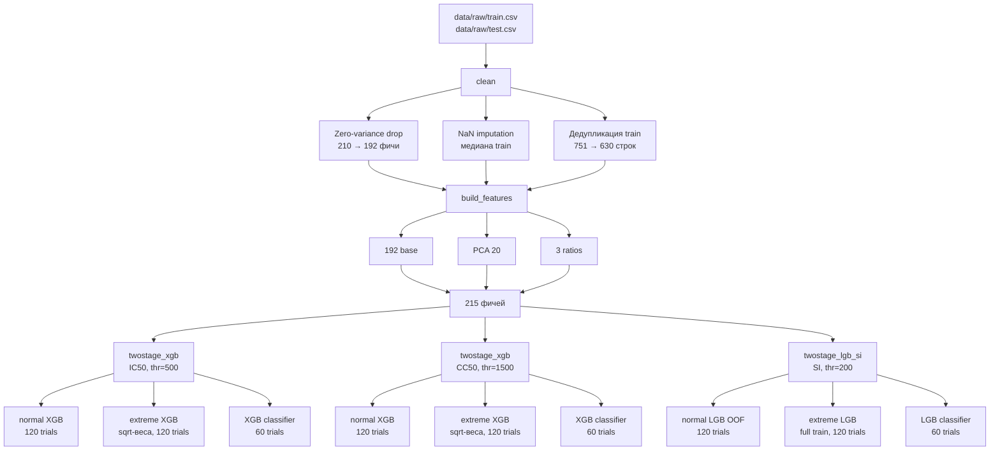

# ChemAI Predict the Cure

## Задача

Предсказать три биологических показателя для химических соединений:
- `IC50` — концентрация вещества, подавляющая вирус на 50%
- `CC50` — концентрация, токсичная для клеток на 50%
- `SI` — индекс селективности: насколько вещество убивает вирус, а не клетки

Метрика: `score = (RMSE_IC50 + RMSE_CC50 + RMSE_SI) / 3`

Данные: 750 молекул в train, 250 в test. Только числовые RDKit-дескрипторы — SMILES
в датасете нет, что закрывает путь к молекулярным fingerprints и предобученным
трансформерам (ChemBERTa, Uni-Mol и т.д.).

---

## Ключевой факт про SI

SI в датасете равен CC50/IC50 математически — совпадает до 11-го знака после запятой.
Химики посчитали его по формуле, а не измерили отдельно.

Это означает, что теоретически SI можно получить из предсказаний CC50 и IC50.
Мы проверяли: `SI_derived = pred_CC50 / pred_IC50` — вес derived SI в блендинге
всегда уходил в 0. Возможная причина в том, что у молекул с высоким SI знаменатель (IC50) очень мал
(0.003–0.4), любая небольшая ошибка в предсказании IC50 даёт огромную ошибку в
частном. Derived SI работал бы только если бы IC50 предсказывался идеально.

---

## Проблема: хвосты убивают RMSE

Все три таргета имеют экстремально тяжёлые правые хвосты:
- IC50: от 0.003 до 4000
- CC50: от 0.7 до 4500
- SI: медиана = 4, максимум = 15 620, скос 15.6

Несколько молекул с высокими значениями доминируют в MSE:

| Таргет | Порог | Молекул | % данных | Вклад в MSE |
|--------|-------|---------|----------|-------------|
| IC50   | >500  | 102     | 14%      | `91%`     |
| CC50   | >1500 | 104     | 14%      | `~60%`    |
| SI     | >200  | 42      | 7%       | `100%`    |

Обычный регрессор с log1p-трансформацией видит это распределение как "почти
нормальное" и компромиссно предсказывает и нормальные, и экстремальные молекулы.
Результат: baseline-модель для SI предсказывала максимум ~390 при реальном 15 620.

---

## Базовые решения

### Log1p-трансформация таргетов

Обучаем модели в log1p-пространстве, предсказания возвращаем через expm1.
Без трансформации модель гонится за выбросами и проигрывает на основных 740 молекулах.

### 5-fold OOF CV

Out-of-fold предсказания — стандарт для надёжной оценки и стекинга.
При 630 обучающих молекулах это ~125 в валидации на фолд.

### Три отдельные модели

Важность фичей по таргетам почти не пересекается:
- IC50: BCUT_MRLOW, VSA_EState8
- CC50: BCUT_MWLOW, PEOE_VSA6
- SI: FractionCSP3, FpDensityMorgan, RingCount

Разная природа таргетов — аргумент в пользу трёх независимых моделей,
а не одной multi-target.

---

## Фичи: PCA(20) + ratios

Без SMILES нет возможности добавить принципиально новые типы фичей.
Использовали два подхода:

`PCA(20):` StandardScaler + PCA на 192 базовых дескрипторах.
Стабильно давал +1–6 OOF RMSE на каждом таргете.

`3 ratio-фичи:`
- `MolWt / HeavyAtomMolWt` — доля водорода в молекулярном весе
- `NumValenceElectrons / MolWt` — электронная плотность
- `BertzCT / MolWt` — нормализованная сложность молекулы

Итого: 192 базовых + 20 PCA + 3 ratios = `215 фичей`.

Пробовали также KMeans cluster id — дал смешанный результат, не включили.

---

## Дедупликация train

В датасете обнаружили 121 строку с одинаковыми дескрипторами но разными таргетами:

```
train[115]: IC50=5.10, CC50=100.00, SI=19.61
train[540]: IC50=5.99, CC50=100.00, SI=16.67  <- те же фичи!
```

53 группы дублей, std IC50 внутри групп до 1655 — биологический шум измерений.
Модель получала противоречивые сигналы от одной и той же молекулы.

`Решение:` агрегировать таргеты медианой по группам. 751 -> 630 строк.

`Результат:` Kaggle score 312 -> `286` (−26 пунктов).

Также проверили: 68 из 250 тест-молекул совпадают с train по фичам. Попробовали
для них подставить медиану train-таргетов вместо предсказания модели. Стало хуже:
286 -> 315. 
Возможная причина: биологический шум настолько велик, что модель с 215 фичами
предсказывает точнее, чем историческая медиана из 1–3 измерений.

---

## Почему XGBoost для IC50/CC50, LGB для SI

В промежуточном эксперименте (nb08) обучали оба алгоритма и оптимизировали
веса блендинга. Результат:

| Алгоритм | Вес в ансамбле |
|----------|----------------|
| XGBoost  | 0.665          |
| LightGBM | 0.335          |

XGBoost оказался сильнее на IC50 и CC50. Для SI XGBoost дал RMSE=778,
тогда как LightGBM — 693.

---

## Two-stage модель

Главный архитектурный приём — разделить предсказание на два режима:

1. `Классификатор` — предсказывает P(таргет > порог)
2. `Normal регрессор` — обычный, без специальных весов
3. `Extreme регрессор` — с sqrt-весами (`weight = sqrt(y)`),
   акцентирует внимание на высоких значениях
4. `Финал:` `(1 − P) × normal + P × extreme`

### Почему sqrt-веса?

Для SI тестировали три варианта весов:

| Веса            | SI RMSE | delta  |
|-----------------|---------|--------|
| Без весов       | 780.77  | —      |
| `log1p(y)`      | 772.21  | +8.56  |
| `sqrt(y)`       | —       | extreme регрессор — OK |
| `sqrt(y)` везде | 877.83  | −97.05 |

sqrt(y) на всём train оказался слишком агрессивным: топ-молекулы получали
вес 20–90×, модель переобучалась под выбросы в ущерб основным молекулам.

Ключевой инсайт: sqrt-агрессивность нужна только в extreme регрессоре,
который специально обучен на высоких значениях. Normal регрессор остаётся
без весов.

### Extreme SI обучается на полном train

16 молекул с SI > 200 — слишком мало для 5-fold CV: ~3 extreme молекулы
на валидационный фолд. OOF-оценка была бы случайной. Решение: обучить
extreme регрессор на всех 630 строках без разбивки. OOF-предсказания для
него — фактически предсказание на train. Пожертвовали честностью метрики

### Выбор порогов 

`THR_SI = 200` — получен экспериментально. Порог 500: 16 extreme молекул,
SI RMSE=749. Порог 200: 42 молекулы, SI RMSE=698 (−82 пункта). Снижение
порога добавило примеры для классификатора, ROC-AUC вырос.

`THR_IC50 = 500` — 102 молекулы (14% данных) дают 91% MSE.
Достаточно для нормального CV (~20 extreme на фолд).

`THR_CC50 = 1500` — порог 500 включал бы 44% данных, extreme регрессор
потерял бы специализацию. Порог 1500 даёт 104 молекулы (14%) при ~60% MSE.

Общий принцип: extreme класс ≤15% данных (специализация) и ≥30 молекул
(обучаемый классификатор).

[Подробнее о выборе порогов](./THR_LOGIC.md)

---

## Что пробовали и отказались

### CatBoost

В первом ансамбле (LGB + CatBoost) оптимизатор весов поставил w_catboost=0.
CatBoost на дефолтных параметрах здесь слабее LGB. Требует отдельного тюнинга,
который не окупается — исключили.

### Блендинг LGB + XGB (стекинг)

Обучили оба алгоритма для каждого таргета, оптимизировали веса через Nelder-Mead.
XGB получил вес 0.665, LGB 0.335. Финальный score улучшился незначительно
(503 -> ~503 OOF). Решили не усложнять пайплайн — взяли только XGB для IC50/CC50
и LGB для SI.

### Feature selection

Проверили: top-N фичей на importance vs OOF RMSE для N in {10,20,30,50,80,120,215}.

| Таргет | Лучший N | OOF (лучший N) | OOF (все 215) |
|--------|----------|----------------|---------------|
| IC50   | 50       | 341.89         | 349.59        |
| CC50   | 80       | 498.14         | 503.72        |
| SI     | 80       | 777.50         | 781.02        |

Переобучение есть, но явный отбор фичей сломал two-stage SI: ROC-AUC классификатора
упал с 0.95 до 0.92 — разные молекулы описываются разными подмножествами дескрипторов.
Итоговый score стал хуже (515 vs 510). Optuna через `feature_fraction` справляется
с отбором лучше явного ограничения.

### Derived SI = CC50_pred / IC50_pred

Проверяли после каждого улучшения IC50 и CC50. Вес derived SI в блендинге
всегда оказывался 0 — two-stage LGB стабильно лучше. Убрали из финального пайплайна.

### Test lookup

68 тест-молекул точно совпадали с train по фичам. Подстановка медианы train-таргетов
вместо предсказания модели: 286 -> 315 (хуже). Биологический шум слишком велик,
модель точнее lookup.

---

## Итоговая архитектура


